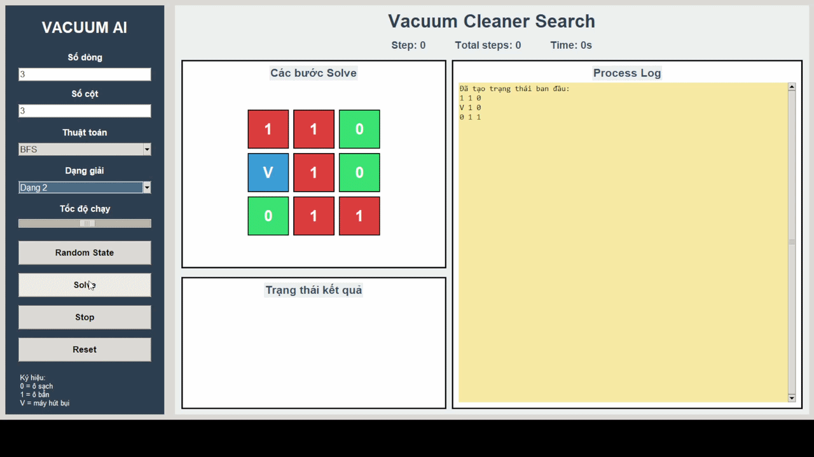
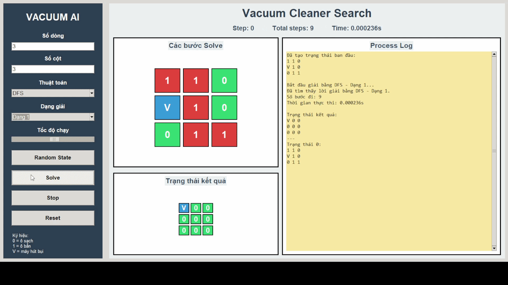
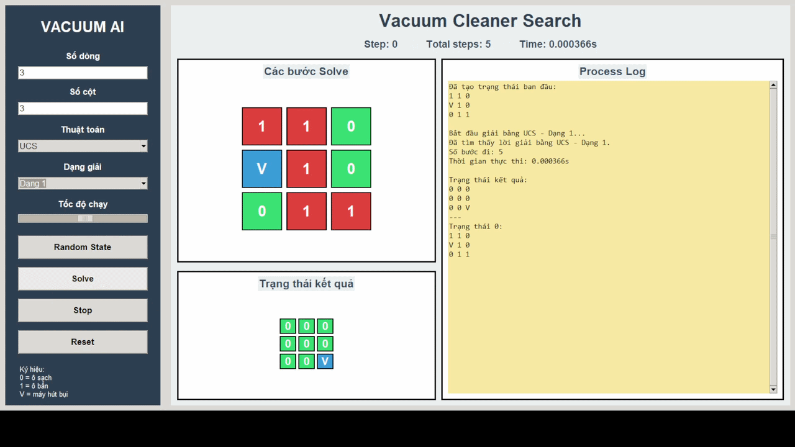

# 🤖 Đồ án cá nhân: Vacuum Cleaner Search

## 1. Giới thiệu

Đây là đồ án cá nhân môn **Trí Tuệ Nhân Tạo**, xây dựng chương trình mô phỏng bài toán **Vacuum Cleaner Problem** bằng ngôn ngữ **Python**.  
Chương trình cho phép tạo ngẫu nhiên một môi trường dạng ma trận, trong đó máy hút bụi di chuyển qua các ô để làm sạch toàn bộ các ô bẩn.

---

## 2. Mục tiêu đồ án

Đồ án tập trung xây dựng một chương trình mô phỏng quá trình giải bài toán **Vacuum Cleaner Problem** sử dụng nhiều thuật toán tìm kiếm trong lĩnh vực **Trí tuệ nhân tạo**:

- Tìm kiếm không có thông tin.
- Tìm kiếm có thông tin.
- Tìm kiếm có cục bộ.
- Tìm kiếm trong môi trường phức tạp.
- Tìm kiếm ràng buộc.
- Học tăng cường.

Thông qua đồ án, ta có thể:

- Hiểu cách mô hình hóa một bài toán AI dưới dạng bài toán tìm kiếm.
- Biết cách biểu diễn trạng thái, hành động, trạng thái đích, chi phí và lời giải.
- Cài đặt, so sánh và phân biệt cách hoạt động của các thuật toán.
- Xây dựng giao diện trực quan bằng Tkinter để quan sát quá trình thuật toán hoạt động.
---
## 3. Mô tả bài toán

Bài toán mô phỏng một máy hút bụi di chuyển trong một ma trận kích thước `m x n`.

Mỗi ô trong ma trận có thể thuộc một trong các trạng thái sau:

| Ký hiệu | Ý nghĩa |
|--------|---------|
| `0` | Ô sạch |
| `1` | Ô bẩn |
| `V` | Vị trí hiện tại của máy hút bụi |

Máy hút bụi có thể di chuyển theo 4 hướng:

- Lên
- Xuống
- Trái
- Phải

Khi máy hút bụi đi đến một ô, ô đó được xem như đã được làm sạch.

---

## 4. Các thuật toán đã được cài đặt gồm:

### 4.1. Tìm kiếm không có thông tin: BFS, DFS, UCS, IDS

- **BFS** - Breadth-First Search
- **DFS** - Depth-First Search
- **UCS** - Uniform Cost Search
- **IDS** - Iterative Deepening Search

#### Thành phần chính của bài toán tìm kiếm

- **Không gian trạng thái**: Các trạng thái của môi trường mxn, trong đó mỗi ô có thể là 0 sạch hoặc 1 bẩn, và máy hút bụi V có thể đứng ở một trong 9 ô.
- **Trạng thái ban đầu**: Là trạng thái xuất phát của bài toán, gồm vị trí ban đầu của máy hút bụi và tình trạng sạch/bẩn của các ô, ví dụ: [[0, 0, 0], [1, 1, 1], [0, 1, V]].
- **Trạng thái đích**: Là trạng thái mong muốn đạt được, khi tất cả các ô trong phòng đều sạch, ví dụ: [[0, 0, 0], [0, 0, 0], [0, 0, V]].
- **Hành động**: Máy hút bụi có thể di chuyển lên, xuống, trái, phải nếu hợp lệ và có thể hút bụi tại ô đang đứng nếu ô đó bẩn.
- **Chi phí**: Mỗi hành động di chuyển hoặc hút bụi có chi phí là 1.
- **Solution**: Là chuỗi các hành động hoặc trạng thái từ trạng thái ban đầu đến trạng thái đích, sao cho tất cả các ô bẩn được làm sạch.

Mỗi thuật toán được cài đặt theo 2 dạng xử lý khác nhau:
- **Dạng 1**: Lấy node ra khỏi frontier rồi mới kiểm tra goal.
- **Dạng 2**: Vừa sinh trạng thái con thì kiểm tra goal ngay. (trừ UCS)
Việc triển khai hai dạng kiểm tra goal giúp quan sát rõ hơn sự khác nhau về thời điểm phát hiện trạng thái đích, đồng thời hỗ trợ so sánh cách hoạt động của các thuật toán tìm kiếm cơ bản trong cùng một môi trường bài toán.

#### Hình ảnh GIF minh họa

| Thuật toán | GIF |
|------------|-----|
| **BFS_Dạng 1** |  |
| **BFS_Dạng 2** |  |
| **DFS_Dạng 1** |  |
| **DFS_Dạng 2** |  |
| **IDS_Dạng 1** |  |
| **IDS_Dạng 2** |  |
| **UCS_Dạng 1** |  |

### 4.2. Tìm kiếm có thông tin: GREEDY, A*, IDA*

#### Thành phần chính của bài toán tìm kiếm

- **Không gian trạng thái**: Các trạng thái của môi trường mxn, trong đó mỗi ô có thể là 0 sạch hoặc 1 bẩn. Ngoài ra, mỗi trạng thái còn bao gồm vị trí hiện tại của máy hút bụi V trong bảng.
- **Trạng thái ban đầu**: Là trạng thái xuất phát của quá trình tìm kiếm, gồm vị trí ban đầu của máy hút bụi và tình trạng sạch/bẩn của các ô. Ví dụ: máy hút bụi bắt đầu ở góc dưới bên phải, các ô bẩn được biểu diễn bằng 1.
- **Trạng thái đích**: Là trạng thái mong muốn đạt được, khi tất cả các ô trong bảng 3x3 đều sạch, tức là toàn bộ các ô đều có giá trị 0.
- **Hành động**: Máy hút bụi có thể di chuyển lên, xuống, trái, phải nếu vị trí di chuyển hợp lệ. Ngoài ra, nếu ô hiện tại đang bẩn thì máy hút bụi có thể thực hiện hành động hút bụi để làm sạch ô đó.
- **Chi phí**: Mỗi hành động di chuyển hoặc hút bụi có chi phí là 1. Đồng thời, các thuật toán GREEDY, A*, IDA* sử dụng hàm heuristic để ưu tiên trạng thái tốt hơn, ví dụ: số ô bẩn còn lại hoặc khoảng cách Manhattan từ máy hút bụi đến ô bẩn gần nhất.
- **Solution**: Là chuỗi các hành động từ trạng thái ban đầu đến trạng thái đích, giúp máy hút bụi di chuyển và làm sạch toàn bộ các ô bẩn trong bảng với chi phí phù hợp hoặc tối ưu tùy theo thuật toán sử dụng.

#### Hình ảnh GIF minh họa

| Thuật toán | GIF |
|------------|-----|
| **GREEDY** |  |
| **A\*** |  |
| **IDA\*** |  |

### 4.3. Tìm kiếm cục bộ: SIMPLE HILL CLIMBING, STEEPEST ASCENT HILL CLIMBING, STOCHASTIC HILL CLIMBING

#### Thành phần chính của bài toán tìm kiếm

- **Không gian trạng thái**: Các trạng thái của môi trường `m x n`, trong đó mỗi ô có thể là `0` sạch hoặc `1` bẩn. Ngoài ra, mỗi trạng thái còn bao gồm vị trí hiện tại của máy hút bụi `V` trong bảng.
- **Trạng thái ban đầu**: Là trạng thái xuất phát của bài toán, gồm vị trí ban đầu của máy hút bụi và tình trạng sạch/bẩn của các ô trong môi trường.
- **Trạng thái đích**: Là trạng thái mong muốn đạt được, khi tất cả các ô bẩn đã được làm sạch, tức là trong ma trận không còn ô nào có giá trị `1`.
- **Hành động**: Máy hút bụi có thể di chuyển theo 4 hướng: lên, xuống, trái, phải nếu hướng di chuyển đó không vượt ra ngoài biên của ma trận. Khi máy hút bụi đi đến một ô bẩn, ô đó được xem như đã được làm sạch.
- **Hàm đánh giá**: Các thuật toán tìm kiếm cục bộ sử dụng hàm `h(n)` để đánh giá trạng thái hiện tại và các trạng thái lân cận. Trong bài này, `h(n)` được xác định là số ô bẩn còn lại trong môi trường. Trạng thái nào có `h(n)` nhỏ hơn thì được xem là tốt hơn.
- **Solution**: Là chuỗi các trạng thái từ trạng thái ban đầu đến trạng thái đích nếu thuật toán tìm được lời giải. Tuy nhiên, các thuật toán tìm kiếm cục bộ có thể bị kẹt tại trạng thái không còn lân cận tốt hơn, nên không phải lúc nào cũng tìm được lời giải tối ưu hoặc tìm được trạng thái đích.

#### Hình ảnh GIF minh họa

| Thuật toán | GIF |
|------------|-----|
| **SIMPLE HILL CLIMBING** |  |
| **STEEPEST ASCENT HILL CLIMBING** |  |
| **STOCHASTIC HILL CLIMBING** |  |

---

## 5. Kết luận

**Đồ án đã đạt được những kết quả sau**: 

- Đồ án triển khai thành công 6 thuật toán thuộc 2 nhóm khác nhau áp dụng cho bài toánh **Vacuum Cleaner Problem**.
- Xây dựng giao diện người dùng bằng Tkinter + Pygame, cho phép nhập trạng thái ban đầu và đích, chọn thuật toán, điều chỉnh tốc độ hiển thị, và xem quá trình giải chi tiết.
- Đánh giá hiệu suất của các thuật toán dựa trên thời gian thực thi, số trạng thái đã thăm, và bộ nhớ sử dụng.
- Học được từ dự án: Hiểu sâu hơn về cách áp dụng các thuật toán AI vào bài toán thực tế, kỹ năng lập trình Python.
- Khó khăn trong việc thực hiện: Một số thuật toán rất trừu tượng, khó hiểu nên có thể mô phỏng không đúng ý tưởng một số thuật toán; Đa số là tài liệu tiếng anh.
- Hướng phát triển: Trực quan hóa 1 cách rõ ràng ý tưởng cảu từng giải thuật, áp dụng để làm game cho đồ án nhóm cuối kỳ.

---

## Tài liệu tham khảo:

1. Russell, S., & Norvig, P. (2016). Artificial Intelligence: A Modern Approach (3rd ed.). Pearson.
2. Scaler Topics. (n.d.). Artificial Intelligence Tutorial. Retrieved from https://www.scaler.com/topics/artificial-intelligence-tutorial
3. GeeksforGeeks. (n.d.). Q-Learning in Python. Retrieved from https://www.geeksforgeeks.org/q-learning-in-python

---

## 👨‍💻 Tác giả

**Họ và tên:** Nguyễn Lê Huy  
**MSSV:** 24110221  
**Môn học:** Trí Tuệ Nhân Tạo  
**Giảng viên hướng dẫn:** Phan Thị Huyền Trang
