# 🤖 Đồ án cá nhân: Vacuum Cleaner Search

## 1. Giới thiệu

Đây là đồ án cá nhân học phần **Trí tuệ nhân tạo**, được xây dựng bằng **Python** và **Tkinter**. Ban đầu chương trình tập trung vào bài toán **Vacuum Cleaner Problem**, sau đó mở rộng thêm nhiều nhóm thuật toán AI khác để mô phỏng, quan sát và so sánh cách hoạt động.

Đồ án không chỉ mô phỏng máy hút bụi trong môi trường ma trận, mà còn có các visualizer và công cụ hỗ trợ riêng cho những nhóm thuật toán có bản chất khác nhau:

| Thành phần | Vai trò |
|---|---|
| **Vacuum Cleaner Problem** | Mô phỏng máy hút bụi di chuyển trong môi trường ma trận |
| **Map Coloring Problem** | Mô phỏng nhóm thuật toán ràng buộc CSP |
| **TicTacToe / Cờ ca rô 3x3** | Mô phỏng nhóm thuật toán đối kháng |
| **Benchmark / Charts** | Chạy thống kê và sinh biểu đồ so sánh thuật toán |

Mục tiêu chính của đồ án là từ mỗi thuật toán của các nhóm thuật toán đã học mô phỏng lại cách thuật toán duyệt trạng thái, chọn bước đi, đánh giá trạng thái và đưa ra lời giải thông qua giao diện trực quan.

---

## 2. Mục tiêu đồ án

Đồ án tập trung xây dựng một chương trình mô phỏng quá trình giải bài toán sử dụng các nhóm thuật toán đã học trong học phần **Trí tuệ nhân tạo**:

- Tìm kiếm không có thông tin.
- Tìm kiếm có thông tin.
- Tìm kiếm cục bộ.
- Tìm kiếm trong môi trường phức tạp.
- Bài toán ràng buộc CSP.
- Thuật toán đối kháng.

Các mục tiêu cụ thể:

- Mô hình hóa bài toán AI theo các thành phần: trạng thái, trạng thái ban đầu, trạng thái đích, hành động, chi phí, hàm đánh giá và lời giải.
- Cài đặt nhiều nhóm thuật toán AI theo từng file riêng, dễ đọc và dễ mở rộng.
- Xây dựng giao diện mô phỏng trực quan bằng **Tkinter**.
- Ghi log từng bước để hỗ trợ quan sát, giải thích thuật toán, viết báo cáo và thuyết trình.
- Mở rộng từ bài toán máy hút bụi sang các bài toán có bản chất khác như CSP và đối kháng.
- Bổ sung chức năng benchmark để thống kê số bước, số node mở rộng, thời gian chạy và sinh biểu đồ so sánh.

---

## 3. Công nghệ sử dụng

| Thành phần | Mô tả |
|---|---|
| Ngôn ngữ | Python |
| Giao diện | Tkinter |
| Vẽ biểu đồ | Matplotlib |
| Lưu kết quả benchmark | CSV |
| Cấu trúc code | Chia theo `core`, `algorithms`, `ui`, `benchmark` |
| Dữ liệu minh họa | Ma trận máy hút bụi, bản đồ tô màu, bàn cờ ca rô 3x3 |
| Mục tiêu | Mô phỏng thuật toán AI, hỗ trợ báo cáo và so sánh thuật toán |

Đồ án chủ yếu sử dụng thư viện chuẩn của Python. Riêng phần biểu đồ cần cài thêm `matplotlib` nếu máy chưa có.

---

## 4. Cấu trúc thư mục

```text
DoAnCaNhan/
├── README.md
├── images/
│   ├── bfs_d1.gif
│   ├── bfs_d2.gif
│   ├── dfs_d1.gif
│   ├── dfs_d2.gif
│   ├── ids_d1.gif
│   ├── ids_d2.gif
│   ├── ucs_d1.gif
│   ├── greedy.gif
│   ├── astar.gif
│   ├── idastar.gif
│   ├── simple_hill_climbing.gif
│   ├── steepest_ascent_hill_climbing.gif
│   ├── stochastic_hill_climbing.gif
│   ├── random_restart_hill_climbing.gif
│   ├── local_beam_search.gif
│   ├── simulated_annealing.gif
│   ├── no_observation_search.gif
│   ├── partial_observation_search.gif
│   ├── and_or_graph_search.gif
│   ├── backtracking.gif
│   ├── forward_checking.gif
│   ├── ac_3.gif
│   ├── min_conflicts.gif
│   ├── minimax.gif
│   ├── alpha_beta.gif
│   └── expectimax.gif
└── Vacuum_Cleaner/
    ├── Main.py
    ├── assets/
    │   └── map_tphcm.png
    ├── core/
    │   └── vacuum_problem.py
    ├── algorithms/
    │   ├── algorithm_manager.py
    │   ├── bfs.py
    │   ├── dfs.py
    │   ├── ucs.py
    │   ├── ids.py
    │   ├── greedy_search.py
    │   ├── astar.py
    │   ├── idastar.py
    │   ├── simple_hill_climbing.py
    │   ├── steepest_ascent_hill_climbing.py
    │   ├── stochastic_hill_climbing.py
    │   ├── random_restart_hill_climbing.py
    │   ├── local_beam_search.py
    │   ├── simulated_annealing.py
    │   ├── no_observation_search.py
    │   ├── partial_observation_search.py
    │   ├── and_or_graph_search.py
    │   ├── backtracking.py
    │   ├── forward_checking.py
    │   ├── ac_3.py
    │   ├── min_conflicts.py
    │   ├── caro_game.py
    │   ├── minimax.py
    │   ├── alpha_beta.py
    │   └── expectimax.py
    ├── benchmark/
    │   ├── benchmark_runner.py
    │   └── chart_generator.py
    ├── reports/
    │   ├── benchmark_data/
    │   │   └── benchmark_results.csv
    │   └── benchmark_charts/
    │       ├── 01_solution_steps.png
    │       ├── 02_expanded_nodes.png
    │       ├── 03_runtime_ms.png
    │       └── ...
    └── ui/
        ├── vacuum_ui.py
        ├── belief_search_ui.py
        ├── map_coloring_ui.py
        ├── tictactoe_ui.py
        └── benchmark_ui.py
```

Lưu ý: thư mục `reports/` và các file biểu đồ sẽ được tạo sau khi chạy chức năng Benchmark / Charts.

### Vai trò các thư mục chính

| Thư mục | Vai trò |
|---|---|
| `core/` | Chứa mô hình bài toán máy hút bụi |
| `algorithms/` | Chứa toàn bộ thuật toán AI đã cài đặt |
| `ui/` | Chứa giao diện mô phỏng bằng Tkinter |
| `benchmark/` | Chạy thống kê và sinh dữ liệu biểu đồ |
| `reports/` | Lưu kết quả benchmark và hình biểu đồ |
| `assets/` | Chứa tài nguyên dùng trong giao diện |
| `images/` | Chứa GIF minh họa dùng cho README hoặc báo cáo |

---

## 5. Cách chạy chương trình

### 5.1. Chạy giao diện chính

#### Bước 1: Mở terminal tại thư mục project

```bash
cd Vacuum_Cleaner
```

#### Bước 2: Cài thư viện vẽ biểu đồ nếu máy chưa có

```bash
pip install matplotlib
```

#### Bước 3: Chạy file chính

```bash
python Main.py
```

Nếu máy dùng lệnh `python3`, có thể chạy:

```bash
python3 Main.py
```

### 5.2. Chạy benchmark bằng terminal

Ngoài giao diện chính, có thể chạy benchmark trực tiếp bằng terminal:

```bash
cd Vacuum_Cleaner
python -m benchmark.benchmark_runner
python -m benchmark.chart_generator
```

Sau khi chạy, chương trình sẽ sinh dữ liệu và biểu đồ tại:

```text
Vacuum_Cleaner/reports/benchmark_data/benchmark_results.csv
Vacuum_Cleaner/reports/benchmark_charts/
```

---

## 6. Cách sử dụng giao diện chính

Trên giao diện chính **VACUUM AI**, người dùng thao tác theo từng nhóm thuật toán.

### 6.1. Đối với các nhóm thuật toán chạy trên môi trường máy hút bụi

Các nhóm thuật toán sau được mô phỏng trên môi trường máy hút bụi hoặc belief state liên quan đến máy hút bụi:

- Tìm kiếm không có thông tin
- Tìm kiếm có thông tin
- Tìm kiếm cục bộ
- Môi trường phức tạp

Quy trình sử dụng:

1. Nhập số dòng và số cột cho môi trường.
2. Chọn **nhóm thuật toán** trong combobox.
3. Chọn **thuật toán cụ thể** thuộc nhóm đó.
4. Bấm **Random State** để tạo trạng thái ban đầu.
5. Bấm **Solve** để chạy thuật toán.
6. Quan sát trạng thái ban đầu, trạng thái kết quả, số bước, thời gian chạy và log xử lý.
7. Điều chỉnh tốc độ mô phỏng bằng thanh **Tốc độ chạy**.
8. Bấm **Stop** để dừng mô phỏng hoặc **Reset** để đưa giao diện về trạng thái ban đầu.

### 6.2. Đối với nhóm ràng buộc CSP

Khi chọn nhóm **Ràng buộc CSP**, chương trình sẽ mở cửa sổ riêng **Map Coloring UI**.

Trong cửa sổ này, người dùng mới chọn thuật toán CSP cần mô phỏng, bao gồm:

- Map Coloring Backtracking.
- Forward Checking.
- AC-3.
- Min-Conflicts.

Cách tổ chức này giúp nhóm CSP được mô phỏng đúng bản chất bài toán ràng buộc, thay vì ép chạy trên môi trường máy hút bụi.

### 6.3. Đối với nhóm thuật toán đối kháng

Khi chọn nhóm **Đối kháng**, chương trình sẽ mở cửa sổ riêng **TicTacToe UI** để mô phỏng bài toán cờ ca rô 3x3.

Trong cửa sổ cờ ca rô, người dùng mới chọn thuật toán đối kháng cần chạy, bao gồm:

- Minimax.
- Alpha-Beta Pruning.
- Expectimax.

Người dùng có thể click trực tiếp lên bàn cờ để tạo trạng thái ban đầu, sau đó bấm **Solve** để thuật toán phân tích và chọn nước đi tốt nhất cho quân **X**.

### 6.4. Benchmark / Charts

Người dùng có thể bấm nút **Benchmark / Charts** để mở giao diện chạy thống kê và sinh biểu đồ. Chức năng này phục vụ phần so sánh thuật toán trong báo cáo.

### 6.5. Ý nghĩa của cách tổ chức giao diện

Giao diện được tổ chức theo hướng:

- Giao diện chính dùng cho các thuật toán tìm kiếm và tối ưu trên môi trường máy hút bụi.
- Nhóm CSP có visualizer riêng để mô phỏng bài toán ràng buộc.
- Nhóm đối kháng có visualizer riêng để mô phỏng trò chơi hai người.
- Phần benchmark được tách riêng để thống kê và sinh biểu đồ phục vụ báo cáo.

Nhờ đó, mỗi nhóm thuật toán được đặt trong đúng dạng bài toán phù hợp. Từ đó giúp việc quan sát và so sánh rõ ràng hơn.

---

## 7. Mô tả bài toán chính: Vacuum Cleaner Problem

Bài toán chính của đồ án là mô phỏng một **máy hút bụi thông minh** di chuyển trong môi trường dạng ma trận `m x n`.

Mỗi ô trong ma trận có thể thuộc một trong các trạng thái sau:

| Ký hiệu | Ý nghĩa                         |
| ------- | ------------------------------- |
| `0`     | Ô sạch                          |
| `1`     | Ô bẩn                           |
| `V`     | Vị trí hiện tại của máy hút bụi |

Máy hút bụi có thể di chuyển theo 4 hướng:

- Lên.
- Xuống.
- Trái.
- Phải.

Khi máy hút bụi di chuyển đến một ô bẩn, ô đó được xem như đã được làm sạch. Mục tiêu của bài toán là tìm ra chuỗi hành động giúp máy hút bụi làm sạch toàn bộ môi trường.

### Thành phần bài toán

| Thành phần | Mô tả |
|---|---|
| Không gian trạng thái | Tất cả các cấu hình có thể của ma trận, bao gồm trạng thái sạch/bẩn của từng ô và vị trí hiện tại của máy hút bụi |
| Trạng thái ban đầu | Ma trận được tạo ngẫu nhiên hoặc trạng thái do chương trình thiết lập |
| Trạng thái đích | Tất cả các ô trong môi trường đều sạch |
| Hành động | Di chuyển lên, xuống, trái, phải |
| Chi phí | Mỗi bước di chuyển có chi phí là 1 |
| Lời giải | Chuỗi trạng thái hoặc chuỗi hành động từ trạng thái ban đầu đến trạng thái đích |


### Vai trò trong đồ án

Bài toán Vacuum Cleaner được dùng làm môi trường chính để mô phỏng và so sánh các nhóm thuật toán:

- Tìm kiếm không có thông tin.
- Tìm kiếm có thông tin.
- Tìm kiếm cục bộ.
- Tìm kiếm trong môi trường phức tạp.

Các thuật toán trong những nhóm này trực tiếp tìm đường đi hoặc tìm chuỗi hành động để đưa máy hút bụi từ trạng thái ban đầu đến trạng thái đích.

### Các bài toán mô phỏng bổ sung

Ngoài bài toán chính Vacuum Cleaner, đồ án còn bổ sung các mô phỏng riêng để phù hợp với bản chất của từng nhóm thuật toán.

| Nhóm / Chức năng | Bài toán hoặc mô phỏng | Lý do tách riêng |
|---|---|---|
| Ràng buộc CSP | Map Coloring Problem | Phù hợp với bài toán gán màu thỏa mãn ràng buộc giữa các vùng |
| Đối kháng | TicTacToe / Cờ ca rô 3x3 | Phù hợp với trò chơi hai người, có lượt đi, đối thủ và đánh giá nước đi |
| Benchmark / Charts | Thống kê và biểu đồ | Phục vụ so sánh thuật toán trong báo cáo |

---

## 8. Các thuật toán đã được cài đặt

### 8.1. Tìm kiếm không có thông tin: BFS, DFS, UCS, IDS

Các thuật toán tìm kiếm không có thông tin không sử dụng heuristic để đánh giá trạng thái. Thuật toán chỉ dựa vào cấu trúc không gian trạng thái, frontier và tập trạng thái đã duyệt để tìm lời giải.

Các thuật toán đã cài đặt gồm:

* **BFS** - Breadth-First Search.
* **DFS** - Depth-First Search.
* **UCS** - Uniform Cost Search.
* **IDS** - Iterative Deepening Search.

#### Thành phần chính của bài toán tìm kiếm

| Thành phần | Mô tả |
|---|---|
| Không gian trạng thái | Các trạng thái của môi trường `m x n`, trong đó mỗi ô có thể là `0` sạch hoặc `1` bẩn, đồng thời có vị trí hiện tại của máy hút bụi `V` |
| Trạng thái ban đầu | Trạng thái xuất phát gồm vị trí ban đầu của máy hút bụi và tình trạng sạch/bẩn của các ô |
| Trạng thái đích | Tất cả các ô trong môi trường đều sạch |
| Hành động | Máy hút bụi di chuyển lên, xuống, trái, phải nếu hợp lệ |
| Chi phí | Mỗi bước di chuyển có chi phí là 1 |
| Lời giải | Chuỗi trạng thái từ trạng thái ban đầu đến trạng thái đích |

Trong nhóm này, một số thuật toán được cài đặt theo hai dạng xử lý:

* **Dạng 1**: Lấy node ra khỏi frontier rồi mới kiểm tra goal.
* **Dạng 2**: Vừa sinh trạng thái con thì kiểm tra goal ngay.

Việc triển khai hai dạng kiểm tra goal giúp quan sát rõ hơn sự khác nhau về thời điểm phát hiện trạng thái đích, từ đó hỗ trợ so sánh cách hoạt động của các thuật toán tìm kiếm cơ bản trong cùng một môi trường.

#### Ý nghĩa từng thuật toán

| Thuật toán | Ý nghĩa |
|---|---|
| BFS | Duyệt theo chiều rộng, đảm bảo tìm được lời giải nông nhất nếu chi phí các bước bằng nhau |
| DFS | Duyệt theo chiều sâu, dùng ít bộ nhớ hơn BFS nhưng không đảm bảo lời giải tối ưu |
| UCS | Luôn chọn node có chi phí đường đi nhỏ nhất, phù hợp khi chi phí hành động khác nhau |
| IDS | Kết hợp DFS và BFS bằng cách tăng dần giới hạn độ sâu, tiết kiệm bộ nhớ hơn BFS |

#### Hình ảnh GIF minh họa

| Thuật toán       | GIF                                                        |
| ---------------- | ---------------------------------------------------------- |
| **BFS - Dạng 1** |  |
| **BFS - Dạng 2** |  |
| **DFS - Dạng 1** |  |
| **DFS - Dạng 2** |  |
| **IDS - Dạng 1** |  |
| **IDS - Dạng 2** |  |
| **UCS**          |         |
---

### 8.2. Tìm kiếm có thông tin: Greedy, A*, IDA*

Các thuật toán tìm kiếm có thông tin sử dụng thêm hàm heuristic để đánh giá trạng thái. Nhờ đó, thuật toán có thể ưu tiên mở rộng những trạng thái có triển vọng tốt hơn thay vì duyệt hoàn toàn mù như nhóm tìm kiếm không có thông tin.

Các thuật toán đã cài đặt gồm:

- **Greedy Best-First Search**.
- **A\*** - A Star Search.
- **IDA\*** - Iterative Deepening A Star.

#### Thành phần chính của bài toán tìm kiếm

| Thành phần | Mô tả |
|---|---|
| Không gian trạng thái | Các trạng thái của môi trường `m x n`, bao gồm vị trí máy hút bụi và trạng thái sạch/bẩn của từng ô |
| Trạng thái ban đầu | Ma trận ban đầu do chương trình tạo ra hoặc do người dùng thiết lập |
| Trạng thái đích | Tất cả các ô bẩn đã được làm sạch |
| Hành động | Di chuyển lên, xuống, trái, phải nếu hợp lệ |
| Chi phí | Mỗi bước di chuyển có chi phí là 1 |
| Hàm heuristic | Dùng để ước lượng mức độ gần đích của một trạng thái, ví dụ số ô bẩn còn lại hoặc khoảng cách từ máy hút bụi đến các ô bẩn |
| Lời giải | Chuỗi trạng thái hoặc chuỗi hành động đưa máy hút bụi từ trạng thái ban đầu đến trạng thái đích |

#### Ý nghĩa từng thuật toán

| Thuật toán | Ý nghĩa |
|---|---|
| Greedy | Ưu tiên trạng thái có heuristic nhỏ nhất, thường nhanh nhưng không đảm bảo tối ưu |
| A\* | Kết hợp chi phí đã đi `g(n)` và heuristic `h(n)` thông qua `f(n) = g(n) + h(n)` |
| IDA\* | Kết hợp A\* với tìm kiếm sâu lặp, tiết kiệm bộ nhớ hơn A\* trong một số trường hợp |

#### Hình ảnh GIF minh họa

| Thuật toán | GIF                                                       |
| ---------- | --------------------------------------------------------- |
| **Greedy** |     |
| **A\***     |      |
| **IDA\***   |  |

---

### 8.3. Tìm kiếm cục bộ: Hill Climbing, Local Beam Search, Simulated Annealing

Các thuật toán tìm kiếm cục bộ không nhất thiết lưu toàn bộ cây tìm kiếm. Thay vào đó, thuật toán thường tập trung cải thiện trạng thái hiện tại dựa trên các trạng thái lân cận.

Các thuật toán đã cài đặt gồm:

* **Simple Hill Climbing**.
* **Steepest Ascent Hill Climbing**.
* **Stochastic Hill Climbing**.
* **Random Restart Hill Climbing**.
* **Local Beam Search**.
* **Simulated Annealing**.

#### Thành phần chính của bài toán tìm kiếm

| Thành phần | Mô tả |
|---|---|
| Không gian trạng thái | Các trạng thái của môi trường `m x n`, gồm vị trí máy hút bụi và tình trạng sạch/bẩn của các ô |
| Trạng thái ban đầu | Trạng thái xuất phát của môi trường |
| Trạng thái đích | Không còn ô bẩn trong ma trận |
| Hành động | Di chuyển lên, xuống, trái, phải nếu hợp lệ |
| Hàm đánh giá | Sử dụng `h(n)` để đánh giá trạng thái. Trong đồ án, `h(n)` thường là số ô bẩn còn lại |
| Lời giải | Chuỗi trạng thái đi từ trạng thái ban đầu đến trạng thái tốt hơn hoặc đến trạng thái đích |

#### Đặc điểm của nhóm thuật toán

| Thuật toán | Đặc điểm |
|---|---|
| Simple Hill Climbing | Chọn trạng thái lân cận đầu tiên tốt hơn trạng thái hiện tại |
| Steepest Ascent Hill Climbing | Xét toàn bộ trạng thái lân cận và chọn trạng thái tốt nhất |
| Stochastic Hill Climbing | Chọn ngẫu nhiên trong các trạng thái lân cận tốt hơn |
| Random Restart Hill Climbing | Chạy Hill Climbing nhiều lần từ các trạng thái khởi đầu khác nhau để giảm khả năng kẹt ở cực trị cục bộ |
| Local Beam Search | Duy trì nhiều trạng thái ứng viên cùng lúc thay vì chỉ một trạng thái hiện tại |
| Simulated Annealing | Cho phép chấp nhận trạng thái xấu hơn với một xác suất nhất định để thoát khỏi cực trị cục bộ |

#### Hình ảnh GIF minh họa

| Thuật toán                        | GIF                                                                                                  |
| --------------------------------- | ---------------------------------------------------------------------------------------------------- |
| **Simple Hill Climbing**          |                    |
| **Steepest Ascent Hill Climbing** |  |
| **Stochastic Hill Climbing**      |            |
| **Random Restart Hill Climbing**  | 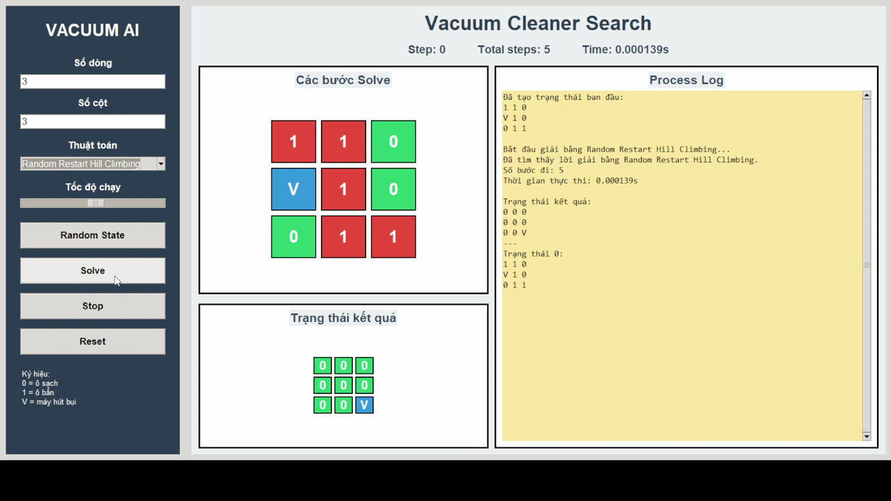   |
| **Local Beam Search**             | 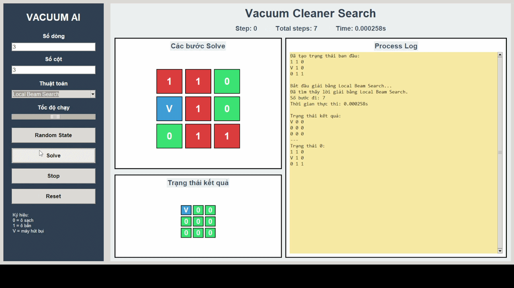                         |
| **Simulated Annealing**           | 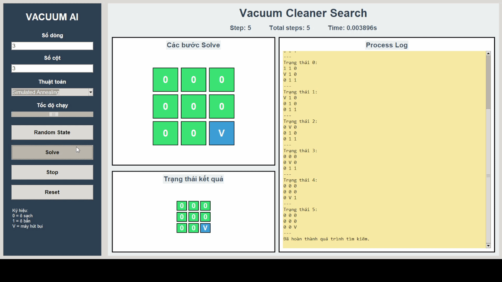                     |

---

### 8.4. Tìm kiếm trong môi trường phức tạp: No Observation, Partial Observation, AND-OR Graph Search

Nhóm thuật toán này mô phỏng các trường hợp tác nhân không biết đầy đủ thông tin về môi trường hoặc phải xử lý nhiều khả năng có thể xảy ra.

Các thuật toán đã cài đặt gồm:

- **No Observation Search**.
- **Partial Observation Search**.
- **AND-OR Graph Search**.

#### Thành phần chính của bài toán

| Thành phần | Mô tả |
|---|---|
| Không gian niềm tin | Tập hợp các trạng thái vật lý mà tác nhân cho rằng có thể đang xảy ra |
| Trạng thái ban đầu | Không chỉ là một trạng thái duy nhất, mà có thể là nhiều trạng thái khả dĩ |
| Trạng thái đích | Tất cả trạng thái trong belief state đều đạt mục tiêu |
| Hành động | Một hành động chung được áp dụng cho các trạng thái trong belief state |
| Hàm đánh giá | Có thể sử dụng tổng số ô bẩn còn lại và khoảng cách Manhattan trong các trạng thái |
| Lời giải | Chuỗi belief state từ ban đầu đến khi tất cả trạng thái khả dĩ đều đạt đích |

#### Mô tả từng thuật toán

| Thuật toán | Mô tả |
|---|---|
| No Observation Search | Mô phỏng trường hợp tác nhân không quan sát được trạng thái thật của môi trường, nên phải xử lý đồng thời nhiều trạng thái có thể xảy ra |
| Partial Observation Search | Mô phỏng trường hợp tác nhân chỉ quan sát được một phần môi trường và cập nhật belief state dựa trên thông tin quan sát |
| AND-OR Graph Search | Phù hợp với môi trường không tất định, trong đó một hành động có thể dẫn đến nhiều kết quả khác nhau |

#### Hình ảnh GIF minh họa

| Thuật toán                     | GIF                                                                                            |
| ------------------------------ | ---------------------------------------------------------------------------------------------- |
| **No Observation Search**      | 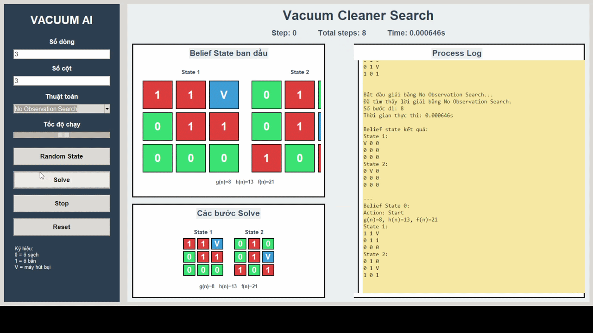           |
| **Partial Observation Search** | 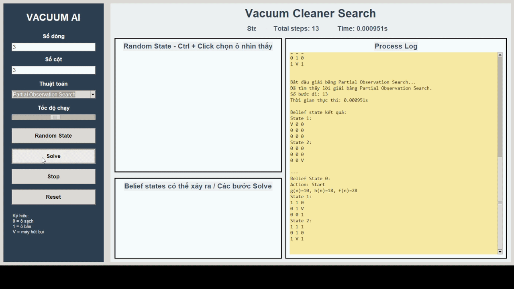 |
| **AND-OR Graph Search**        |                |

---

### 8.5. Các thuật toán tìm kiếm ràng buộc CSP: Backtracking, Forward Checking, AC-3, Min-Conflicts

Nhóm thuật toán ràng buộc CSP được mô phỏng bằng bài toán **Map Coloring Problem**. Đây là bài toán gán màu cho các vùng trên bản đồ sao cho hai vùng kề nhau không được trùng màu.

Nhóm này được tách sang visualizer riêng **Map Coloring UI** để phù hợp hơn với bản chất của bài toán ràng buộc.

Các thuật toán đã cài đặt gồm:

* **Map Coloring Backtracking**.
* **Forward Checking**.
* **AC-3**.
* **Min-Conflicts**.

#### Thành phần chính của bài toán CSP

| Thành phần | Mô tả |
|---|---|
| Biến | Mỗi biến đại diện cho một vùng trên bản đồ cần được tô màu |
| Miền giá trị | Tập màu có thể gán cho từng vùng |
| Ràng buộc | Hai vùng kề nhau không được có cùng màu |
| Trạng thái | Một phép gán màu hiện tại cho một số hoặc toàn bộ vùng |
| Hành động | Chọn một vùng chưa tô và gán màu hợp lệ cho vùng đó |
| Hàm mục tiêu | Tất cả các vùng được tô màu và không vi phạm ràng buộc |
| Lời giải | Một phép gán màu hoàn chỉnh, hợp lệ cho toàn bộ bản đồ |

#### Mô tả từng thuật toán

| Thuật toán | Mô tả |
|---|---|
| Backtracking | Thử gán màu cho từng vùng, nếu vi phạm ràng buộc thì quay lui để thử lựa chọn khác |
| Forward Checking | Sau khi gán màu cho một vùng sẽ cập nhật miền giá trị của các vùng lân cận để phát hiện sớm xung đột |
| AC-3 | Duy trì tính nhất quán cung bằng cách loại bỏ các giá trị không còn phù hợp khỏi miền giá trị |
| Min-Conflicts | Bắt đầu từ một phép gán đầy đủ, sau đó sửa vùng đang xung đột bằng màu gây ít xung đột nhất |

#### Hình ảnh GIF minh họa

| Thuật toán           | GIF                                                                        |
| -------------------- | -------------------------------------------------------------------------- |
| **Backtracking**     |          |
| **Forward Checking** | 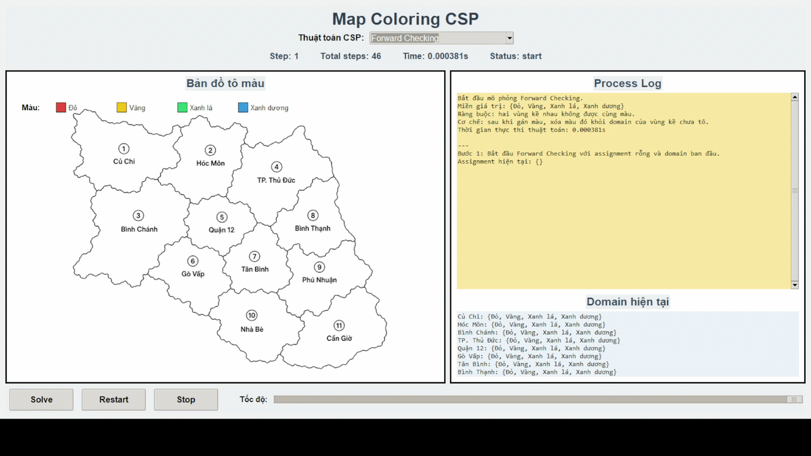 |
| **AC-3**             |                          |
| **Min-Conflicts**    | 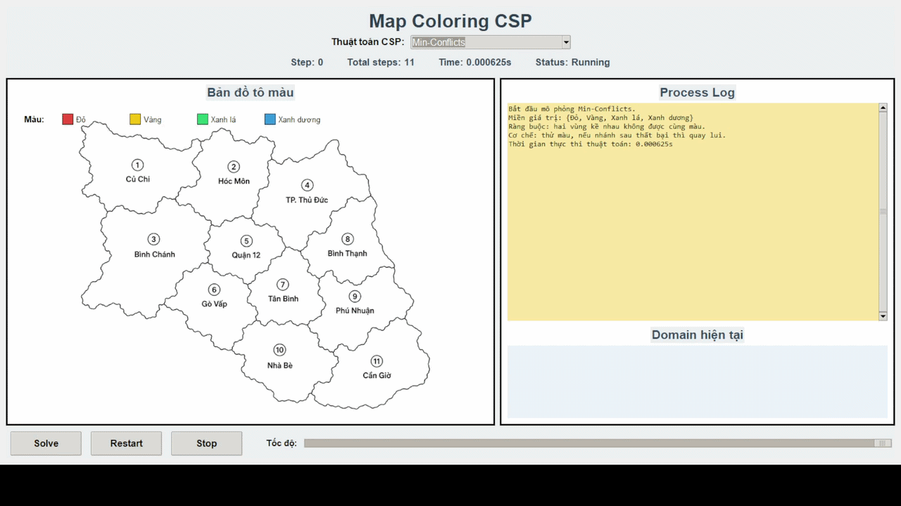       |

---

### 8.6. Các thuật toán đối kháng: Minimax, Alpha-Beta Pruning, Expectimax

Nhóm thuật toán đối kháng được mô phỏng bằng bài toán **TicTacToe / Cờ ca rô 3x3**. Đây là dạng bài toán trò chơi hai người, trong đó mỗi người chơi lần lượt chọn nước đi để đạt kết quả tốt nhất cho mình.

Nhóm này được tách sang visualizer riêng **TicTacToe UI** để thể hiện rõ hơn các khái niệm như lượt chơi, trạng thái bàn cờ, điểm đánh giá, nước đi tốt nhất, cắt tỉa và yếu tố ngẫu nhiên.

Các thuật toán đã cài đặt gồm:

- **Minimax**.
- **Alpha-Beta Pruning**.
- **Expectimax**.

#### Thành phần chính của bài toán đối kháng

| Thành phần | Mô tả |
|---|---|
| Trạng thái | Cấu hình hiện tại của bàn cờ 3x3 |
| Người chơi MAX | Quân `X`, đại diện cho thuật toán cần chọn nước đi tốt nhất |
| Người chơi MIN | Quân `O`, đại diện cho đối thủ trong Minimax và Alpha-Beta |
| Chance node | Nút ngẫu nhiên trong Expectimax, mô phỏng đối thủ không luôn chọn nước đi tối ưu |
| Hành động | Đặt quân vào một ô trống trên bàn cờ |
| Trạng thái kết thúc | X thắng, O thắng, hòa hoặc bàn cờ đầy |
| Hàm đánh giá | Gán điểm cho trạng thái, ví dụ X thắng là điểm dương, O thắng là điểm âm, hòa là 0 |
| Lời giải | Nước đi tốt nhất mà thuật toán đề xuất cho quân X |

#### Mô tả từng thuật toán

| Thuật toán | Mô tả |
|---|---|
| Minimax | Giả định cả hai người chơi đều chơi tối ưu. MAX chọn điểm lớn nhất, MIN chọn điểm nhỏ nhất |
| Alpha-Beta Pruning | Tối ưu Minimax bằng cách cắt bỏ các nhánh không cần xét, kết quả thường giống Minimax nhưng duyệt ít node hơn |
| Expectimax | Mô hình hóa đối thủ như chance node, lấy giá trị trung bình kỳ vọng thay vì luôn chọn nước đi nhỏ nhất |

#### Cách mô phỏng trong giao diện

Trong **TicTacToe UI**, người dùng có thể:

1. Chọn thuật toán đối kháng trong combobox.
2. Click vào bàn cờ để tạo trạng thái ban đầu.
3. Chọn độ sâu tìm kiếm.
4. Bấm **Solve** để thuật toán phân tích bàn cờ.
5. Quan sát log xử lý, số node mở rộng, điểm các nước đi ứng viên và nước đi tốt nhất.
6. Bấm **Demo** để tạo bàn cờ mẫu hoặc **Clear** để xóa bàn cờ.

Visualizer được thiết kế để thuật toán chọn nước đi cho quân **X**. Vì vậy, trạng thái bàn cờ cần hợp lệ và phải đến lượt **X** thì mới chạy Solve.

#### Hình ảnh GIF minh họa

| Thuật toán             | GIF                                                                    |
| ---------------------- | ---------------------------------------------------------------------- |
| **Minimax**            | 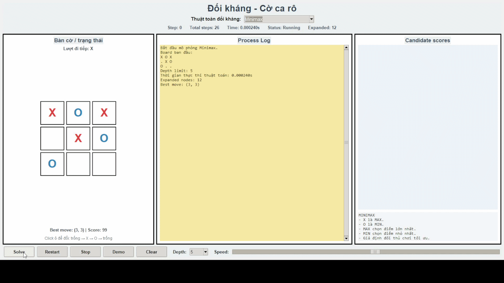               |
| **Alpha-Beta Pruning** | 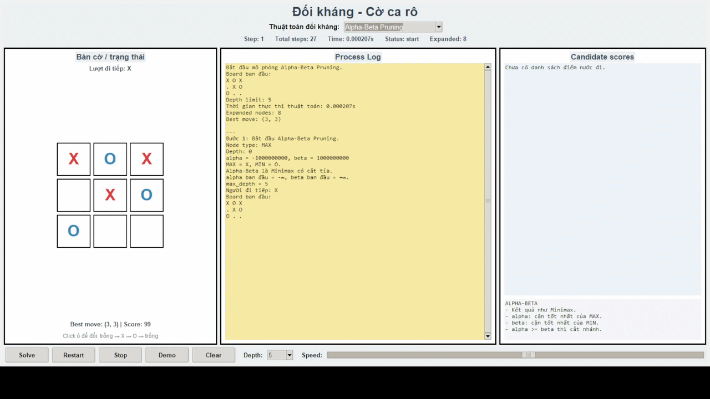 |
| **Expectimax**         | 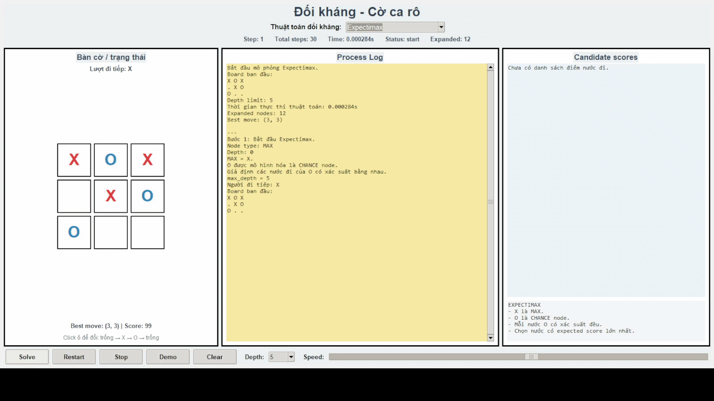         |

---

## 9. Benchmark và biểu đồ so sánh

Đồ án có bổ sung chức năng **Benchmark / Charts** để chạy thống kê và sinh biểu đồ phục vụ báo cáo.

### 9.1. Mục tiêu benchmark

Benchmark được dùng để:

- Đo số bước lời giải.
- Đo số node mở rộng.
- Đo thời gian chạy.
- Đánh giá tỷ lệ thành công của nhóm tìm kiếm cục bộ.
- So sánh số lần gán màu, số lần quay lui trong nhóm CSP.
- So sánh số node mở rộng trong cây trò chơi của nhóm đối kháng.
- Tạo biểu đồ PNG để đưa vào báo cáo.

### 9.2. Cách chạy benchmark

Có thể chạy benchmark bằng giao diện chính thông qua nút **Benchmark / Charts**.

Ngoài ra, có thể chạy trực tiếp bằng terminal:

```bash
cd Vacuum_Cleaner
python -m benchmark.benchmark_runner
python -m benchmark.chart_generator
```

### 9.3. File kết quả

Sau khi chạy benchmark, chương trình tạo các file:

```text
Vacuum_Cleaner/reports/benchmark_data/benchmark_results.csv
Vacuum_Cleaner/reports/benchmark_charts/
```

### 9.4. Các biểu đồ được sinh ra

| Biểu đồ                                                                                                                                       | Ý nghĩa                                                         |
| --------------------------------------------------------------------------------------------------------------------------------------------- | --------------------------------------------------------------- |
| 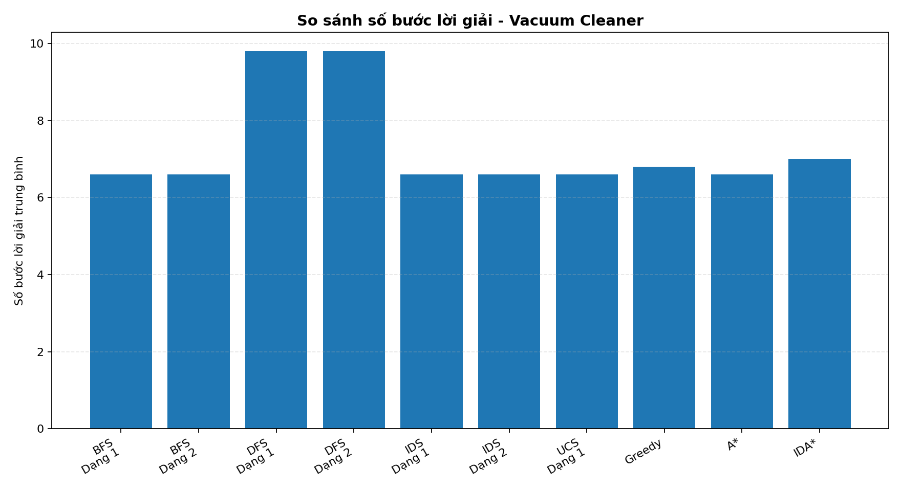                           | So sánh số bước lời giải của các thuật toán trên Vacuum Cleaner |
| 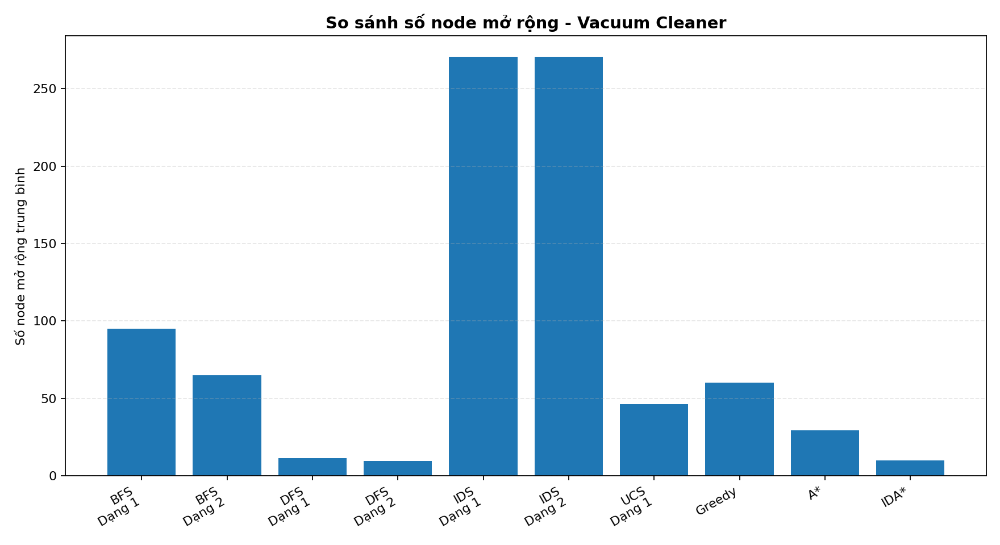                            | So sánh số node mở rộng                                         |
| 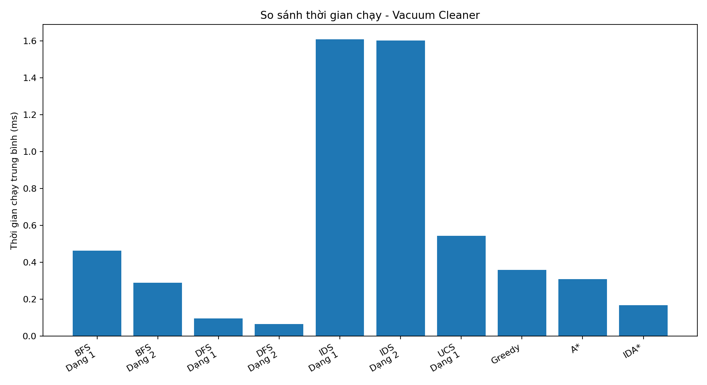                                 | So sánh thời gian chạy                                          |
| 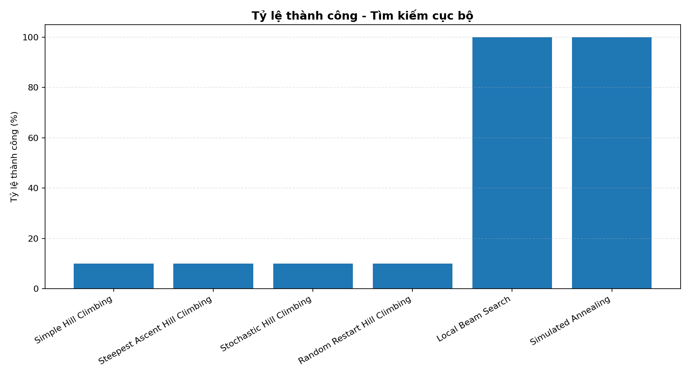              | Tỷ lệ thành công của nhóm tìm kiếm cục bộ                       |
| 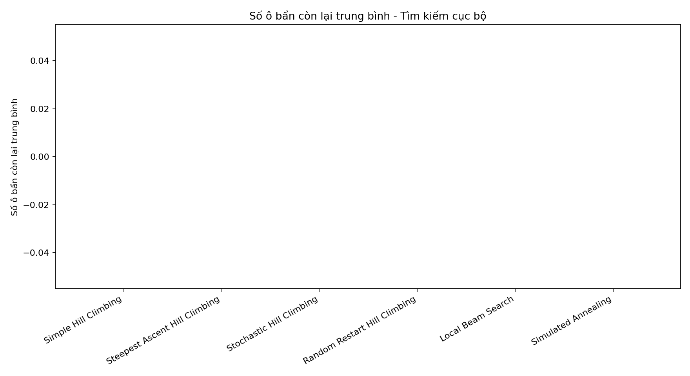              | Số ô bẩn còn lại trung bình của nhóm tìm kiếm cục bộ            |
| 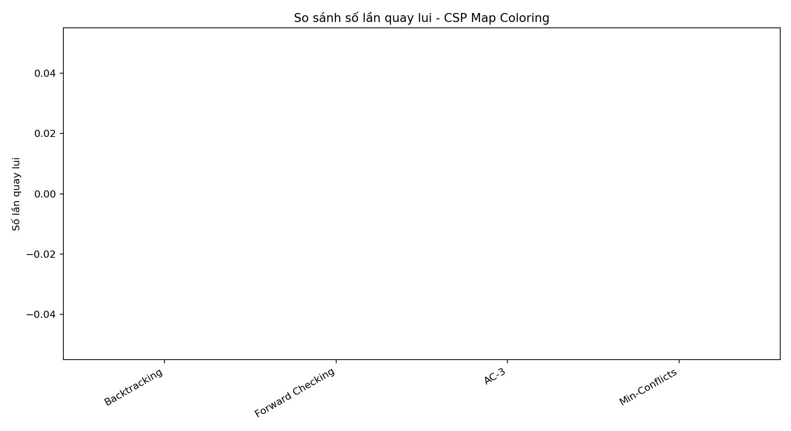                               | Số lần quay lui trong nhóm CSP                                  |
| 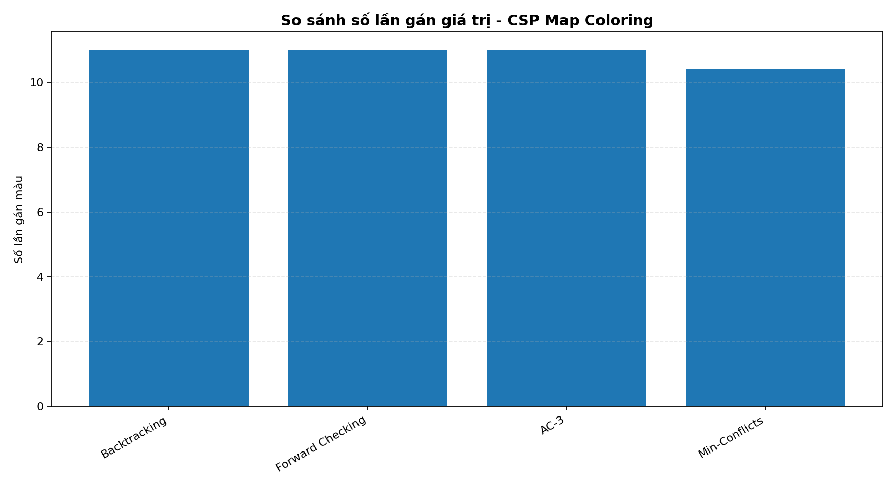                               | Số lần gán màu trong nhóm CSP                                   |
| 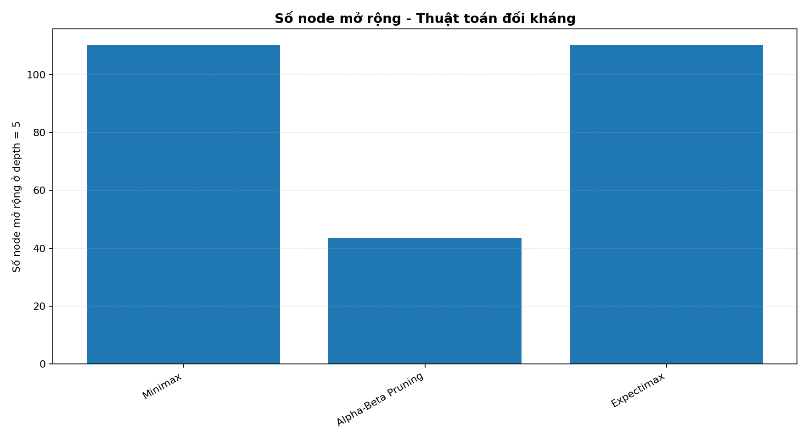 | Số node mở rộng của Minimax, Alpha-Beta và Expectimax           |
| 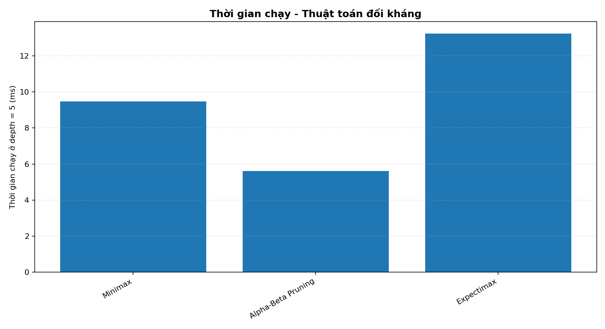         | Thời gian chạy của nhóm đối kháng                               |
| 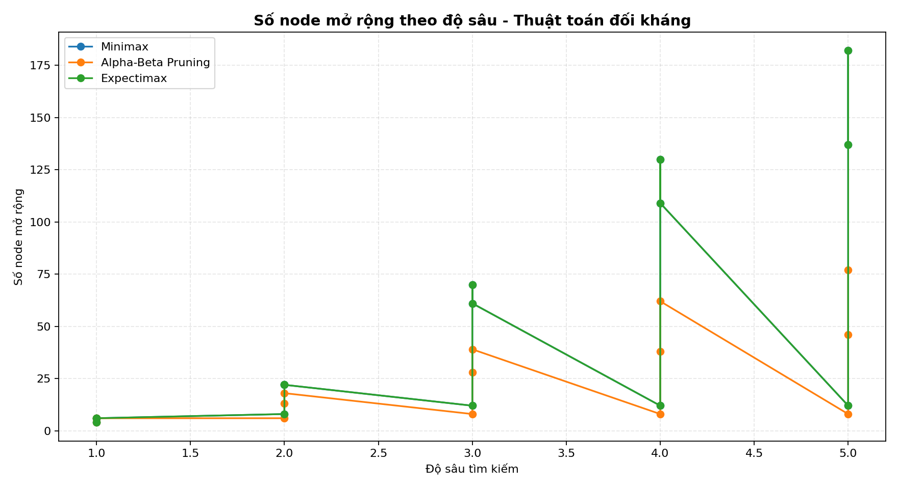  | Số node mở rộng theo độ sâu của nhóm đối kháng                  |

#### Lưu ý:

Trong biểu đồ số node mở rộng theo độ sâu, đường **Minimax** có thể trùng hoặc gần trùng với **Expectimax**. Nguyên nhân là cả hai thuật toán đều duyệt gần như toàn bộ cây trò chơi ở cùng một độ sâu.

Điểm khác biệt chính nằm ở cách đánh giá node:

- **Minimax** giả định đối thủ chơi tối ưu.
- **Expectimax** tính giá trị kỳ vọng tại các chance node.
- **Alpha-Beta Pruning** có cơ chế cắt tỉa nên thường mở rộng ít node hơn.

---

## 10. Kết luận

**Đồ án đã đạt được những kết quả sau:**

- Đồ án đã triển khai và mô phỏng 6 nhóm thuật toán đã học trong học phần **Trí tuệ nhân tạo**, bao gồm: tìm kiếm không có thông tin, tìm kiếm có thông tin, tìm kiếm cục bộ, tìm kiếm trong môi trường phức tạp, bài toán ràng buộc CSP và thuật toán đối kháng.
- Xây dựng được giao diện mô phỏng bằng **Python Tkinter**, cho phép người dùng chọn nhóm thuật toán, chọn thuật toán, tạo trạng thái ban đầu, điều chỉnh tốc độ mô phỏng và quan sát quá trình xử lý thông qua log trực quan.
- Bài toán **Vacuum Cleaner Problem** được sử dụng làm môi trường chính để mô phỏng các thuật toán tìm kiếm và tối ưu. Ngoài ra, đồ án còn mở rộng thêm visualizer riêng cho **Map Coloring Problem** đối với nhóm CSP và **TicTacToe / Cờ ca rô 3x3** đối với nhóm thuật toán đối kháng.
- Các thuật toán được tổ chức theo từng file riêng, có ghi chú trong code, giúp dễ theo dõi, dễ mở rộng và thuận tiện cho việc trình bày trong báo cáo.
- Chương trình đã bổ sung chức năng **Benchmark / Charts** để hỗ trợ so sánh thuật toán thông qua các tiêu chí như số bước lời giải, số node mở rộng, thời gian chạy, tỷ lệ thành công và các chỉ số đặc thù của từng nhóm thuật toán.
- Thông qua quá trình thực hiện, em hiểu rõ hơn cách mô hình hóa một bài toán AI thành các thành phần như trạng thái, trạng thái ban đầu, trạng thái đích, hành động, chi phí, hàm đánh giá và lời giải. Đồng thời, em cũng rèn luyện thêm kỹ năng lập trình Python, tổ chức code theo module và xây dựng giao diện trực quan.
- Khó khăn trong quá trình thực hiện là một số thuật toán có tính trừu tượng cao, đặc biệt là nhóm môi trường phức tạp, CSP và đối kháng. Vì vậy, việc thiết kế visualizer sao cho vừa đúng ý tưởng thuật toán vừa dễ quan sát là phần mất nhiều thời gian.
- Hướng phát triển tiếp theo là tiếp tục hoàn thiện giao diện, cải thiện hệ thống benchmark, mở rộng bài toán sang các môi trường lớn hơn và áp dụng kinh nghiệm từ đồ án cá nhân vào đồ án nhóm cuối kỳ.

---

## 11. Hạn chế và hướng phát triển

### 11.1. Hạn chế

- Một số thuật toán có tính ngẫu nhiên nên kết quả benchmark có thể thay đổi giữa các lần chạy.
- Một số chỉ số như bộ nhớ sử dụng mới được đánh giá tương đối thông qua số node mở rộng hoặc kích thước frontier.
- Nhóm CSP và nhóm đối kháng được mô phỏng trên bài toán riêng nên không so sánh trực tiếp số bước lời giải với Vacuum Cleaner.
- Bàn cờ đối kháng hiện tại sử dụng kích thước 3x3, phù hợp cho mô phỏng nhưng chưa thể hiện hết độ phức tạp của các trò chơi lớn hơn.

### 11.2. Hướng phát triển

- Bổ sung thêm nhiều bản đồ và trạng thái kiểm thử.
- Cải thiện benchmark để chạy nhiều lần và lấy giá trị trung bình.
- Bổ sung thêm chỉ số về bộ nhớ sử dụng khi chạy thuật toán.
- Mở rộng cờ ca rô từ 3x3 lên kích thước lớn hơn.
- Tối ưu giao diện để hỗ trợ mô phỏng trên môi trường lớn hơn.

---

## Tài liệu tham khảo:

1. Russell, S., & Norvig, P. (2016). *Artificial Intelligence: A Modern Approach* (3rd ed.). Pearson.
2. Russell, S., & Norvig, P. (2021). *Artificial Intelligence: A Modern Approach* (4th ed.). Pearson.
3. Scaler Topics. (n.d.). *Artificial Intelligence Tutorial*. Retrieved from https://www.scaler.com/topics/artificial-intelligence-tutorial
4. GeeksforGeeks. (n.d.). *Artificial Intelligence Algorithms*. Retrieved from https://www.geeksforgeeks.org/artificial-intelligence/

---

## 👨‍💻 Tác giả

| Thông tin | Nội dung |
|---|---|
| Họ và tên | Nguyễn Lê Huy |
| MSSV | 24110221 |
| Môn học | Trí tuệ nhân tạo |
| Giảng viên hướng dẫn | Phan Thị Huyền Trang |
