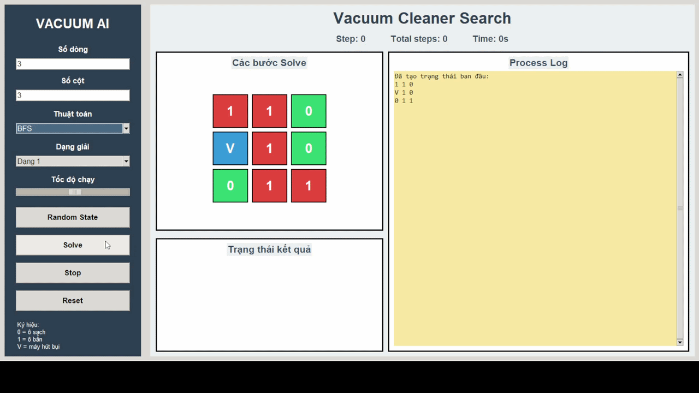
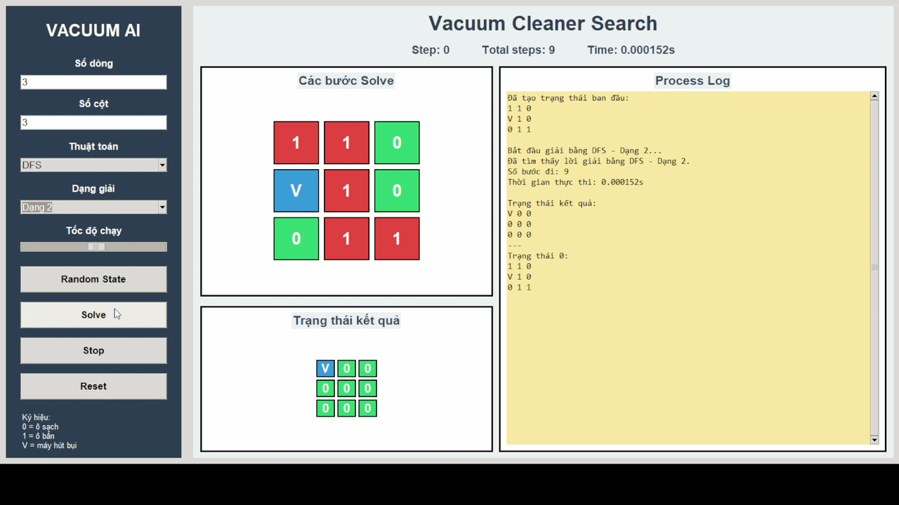
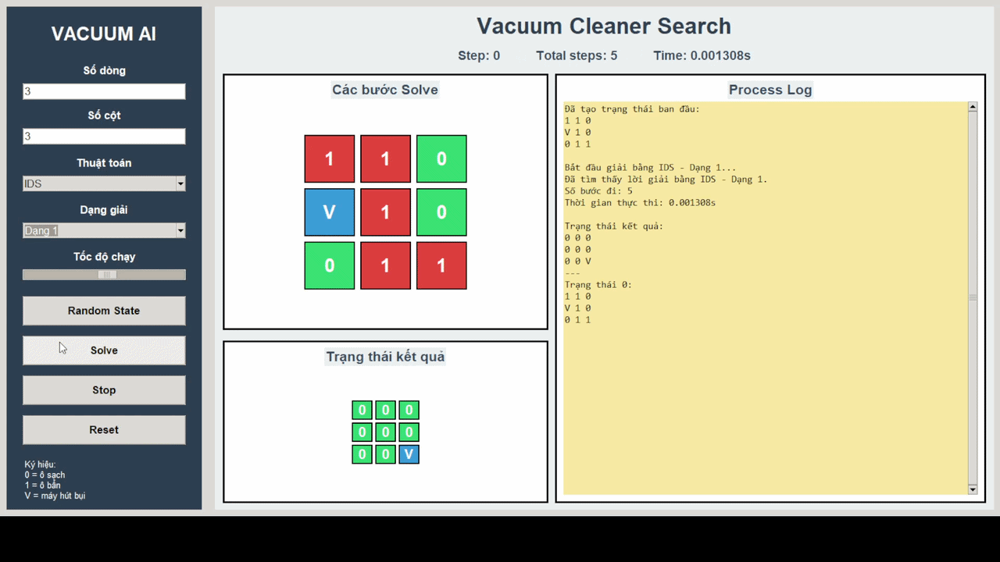
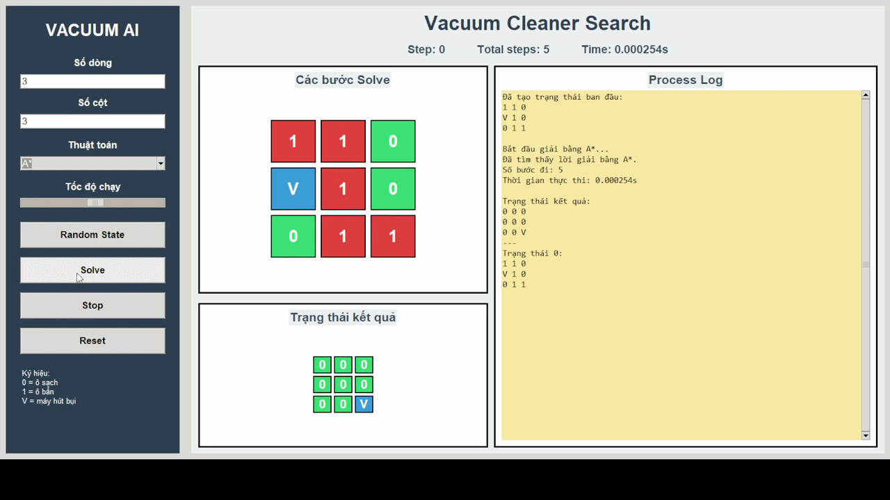
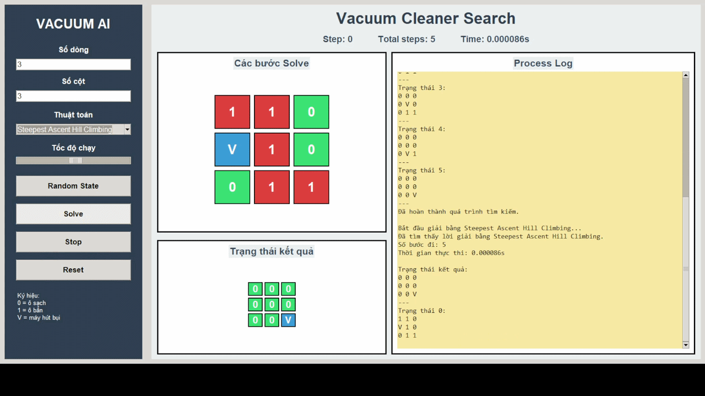
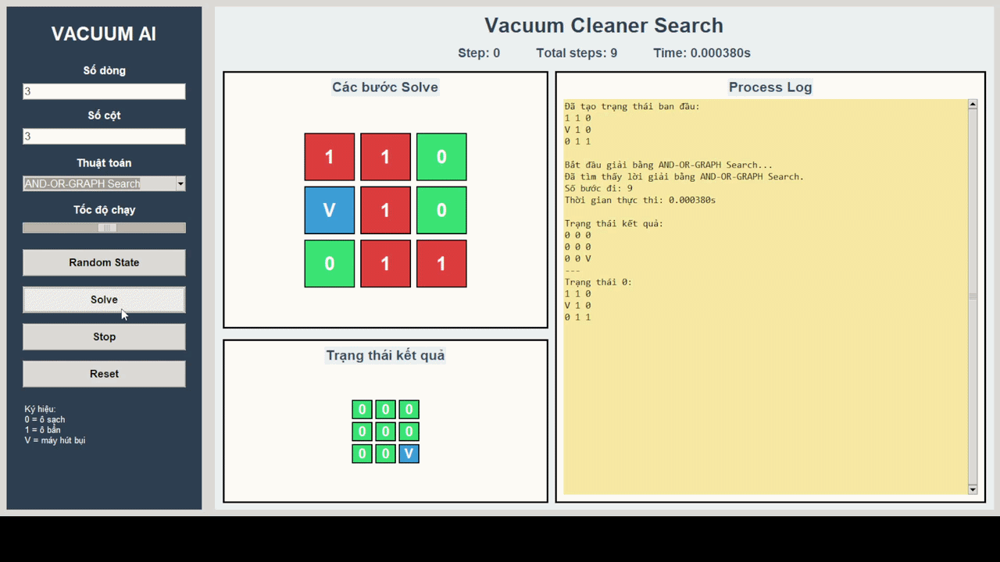
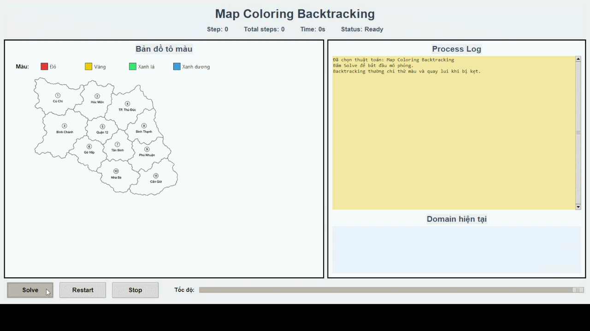
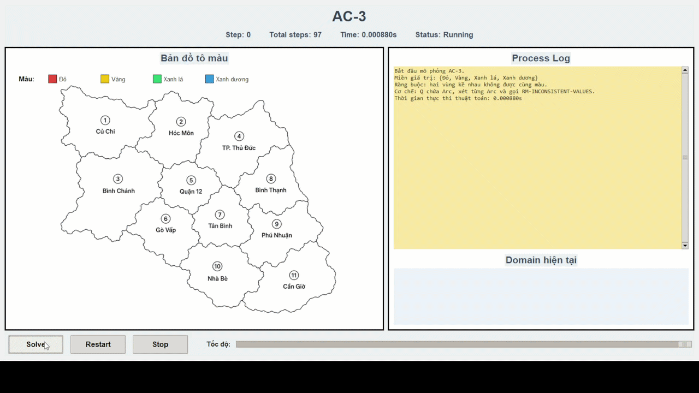

# 🤖 Học phần: Trí tuệ nhân tạo

## 1. Giới thiệu học phần

**Trí tuệ nhân tạo** là học phần cung cấp các kiến thức nền tảng về cách xây dựng hệ thống có khả năng suy luận, tìm kiếm lời giải, ra quyết định và xử lý các bài toán trong môi trường khác nhau.

Trong học phần này, em được tiếp cận các bài toán cơ bản của AI thông qua việc mô hình hóa bài toán, xây dựng không gian trạng thái, xác định trạng thái ban đầu, trạng thái đích, hành động, chi phí, hàm đánh giá và lời giải. Thông qua đó em có thể thiết kế mô phỏng và đánh giá cách hoạt động của nhiều nhóm thuật toán khác nhau khi giải quyết các bài toán khác nhau.

Repo này được xây dựng nhằm tổng hợp các nội dung thực hành, mô phỏng thuật toán và đồ án cá nhân trong học phần. Các thuật toán được minh họa thông qua giao diện trực quan giúp quan sát quá trình thuật toán duyệt trạng thái, lựa chọn hành động, đánh giá trạng thái và tìm lời giải.

Các nội dung chính của học phần gồm:

- Tìm kiếm không có thông tin.
- Tìm kiếm có thông tin.
- Tìm kiếm cục bộ.
- Tìm kiếm trong môi trường phức tạp.
- Bài toán thỏa mãn ràng buộc CSP.
- Thuật toán đối kháng.

Thông qua các bài thực hành và đồ án, em không chỉ nắm được lý thuyết mà còn hiểu cách áp dụng thuật toán AI vào những bài toán cụ thể như máy hút bụi, tô màu bản đồ, môi trường không quan sát đầy đủ và trò chơi đối kháng.

---

## 2. Mục tiêu học phần

Học phần hướng đến các mục tiêu chính sau:

- Hiểu được khái niệm cơ bản về Trí tuệ nhân tạo và vai trò của AI trong khoa học máy tính.
- Biết cách biểu diễn một bài toán AI dưới dạng không gian trạng thái.
- Xác định được trạng thái ban đầu, trạng thái đích, hành động, chi phí, hàm đánh giá và lời giải của một bài toán.
- Cài đặt được các thuật toán tìm kiếm cơ bản bằng ngôn ngữ lập trình Python.
- Phân biệt được tìm kiếm không có thông tin và tìm kiếm có thông tin.
- Hiểu được vai trò của heuristic trong các thuật toán như Greedy, A* và IDA*.
- Hiểu được cách các thuật toán tìm kiếm cục bộ cải thiện trạng thái hiện tại và xử lý cực trị cục bộ.
- Làm quen với môi trường không quan sát đầy đủ, belief state và tìm kiếm trong môi trường không tất định.
- Hiểu được cách mô hình hóa và giải quyết bài toán thỏa mãn ràng buộc CSP.
- Hiểu được nguyên lý ra quyết định trong trò chơi hai người thông qua Minimax, Alpha-Beta Pruning và Expectimax.
- So sánh được ưu điểm, hạn chế và phạm vi áp dụng của từng nhóm thuật toán.
- Rèn luyện kỹ năng phân tích thuật toán, tổ chức code, xây dựng chương trình mô phỏng và trực quan hóa quá trình giải.

---

## 3. Nội dung thuật toán được học và mô phỏng

### 3.1. Tìm kiếm không có thông tin

Tìm kiếm không có thông tin là nhóm thuật toán không sử dụng tri thức bổ sung về khoảng cách hoặc mức độ gần với trạng thái đích. Thuật toán chỉ dựa vào cấu trúc không gian trạng thái, frontier và tập trạng thái đã duyệt để tìm lời giải.

Các thuật toán tiêu biểu:

- **BFS** - Breadth-First Search.
- **DFS** - Depth-First Search.
- **UCS** - Uniform Cost Search.
- **IDS** - Iterative Deepening Search.

Đặc điểm chính:

| Thuật toán | Đặc điểm                                                                                         |
| ---------- | ------------------------------------------------------------------------------------------------ |
| **BFS**    | Mở rộng node theo từng mức, đảm bảo tìm được lời giải nông nhất nếu chi phí các bước bằng nhau   |
| **DFS**    | Mở rộng sâu theo từng nhánh, tiết kiệm bộ nhớ hơn BFS nhưng không đảm bảo tối ưu                 |
| **UCS**    | Luôn chọn node có chi phí đường đi nhỏ nhất, phù hợp với bài toán có chi phí hành động khác nhau |
| **IDS**    | Kết hợp ưu điểm của DFS và BFS bằng cách tăng dần giới hạn độ sâu                                |

#### Giao diện minh họa

| Thuật toán       | Giao diện                                                  |
| ---------------- | ---------------------------------------------------------- |
| **BFS - Dạng 1** |  |
| **BFS - Dạng 2** |  |
| **DFS - Dạng 1** |  |
| **DFS - Dạng 2** |  |
| **IDS - Dạng 1** |  |
| **IDS - Dạng 2** |  |
| **UCS**          |         |

---

### 3.2. Tìm kiếm có thông tin

Tìm kiếm có thông tin sử dụng thêm hàm heuristic để đánh giá trạng thái và ưu tiên mở rộng những trạng thái có khả năng dẫn đến lời giải tốt hơn.

Các thuật toán tiêu biểu:

- **Greedy Best-First Search**.
- **A\*** - A Star Search.
- **IDA\*** - Iterative Deepening A Star.

Đặc điểm chính:

| Thuật toán                   | Đặc điểm                                                                                                 |
| ---------------------------- | -------------------------------------------------------------------------------------------------------- |
| **Greedy Best-First Search** | Chọn node có heuristic nhỏ nhất, tức là node có vẻ gần trạng thái đích nhất tại thời điểm xét            |
| **A\***                       | Kết hợp chi phí thực tế đã đi `g(n)` và chi phí ước lượng đến đích `h(n)` thông qua `f(n) = g(n) + h(n)` |
| **IDA\***                     | Kết hợp ý tưởng của A* và IDS, phù hợp khi muốn giảm bộ nhớ sử dụng                                      |

#### Giao diện minh họa

| Thuật toán | Giao diện                                                 |
| ---------- | --------------------------------------------------------- |
| **Greedy** |     |
| **A\***     |      |
| **IDA\***   |  |

---

### 3.3. Tìm kiếm cục bộ

Tìm kiếm cục bộ là nhóm thuật toán tập trung cải thiện trạng thái hiện tại thay vì lưu toàn bộ cây tìm kiếm. Nhóm thuật toán này thường được dùng trong các bài toán tối ưu có không gian trạng thái lớn.

Các thuật toán tiêu biểu:

- **Simple Hill Climbing**.
- **Steepest Ascent Hill Climbing**.
- **Stochastic Hill Climbing**.
- **Random Restart Hill Climbing**.
- **Local Beam Search**.
- **Simulated Annealing**.

Đặc điểm chính:

- Phù hợp với các bài toán tối ưu.
- Không nhất thiết lưu toàn bộ đường đi từ trạng thái ban đầu.
- Có thể gặp cực trị cục bộ nếu không có cơ chế thoát khỏi trạng thái kẹt.
- Một số thuật toán có yếu tố ngẫu nhiên nên kết quả có thể thay đổi giữa các lần chạy.

| Thuật toán                        | Đặc điểm                                                                                                |
| --------------------------------- | ------------------------------------------------------------------------------------------------------- |
| **Simple Hill Climbing**          | Chọn trạng thái lân cận đầu tiên tốt hơn trạng thái hiện tại                                            |
| **Steepest Ascent Hill Climbing** | Xét toàn bộ trạng thái lân cận và chọn trạng thái tốt nhất                                              |
| **Stochastic Hill Climbing**      | Chọn ngẫu nhiên trong các trạng thái lân cận tốt hơn                                                    |
| **Random Restart Hill Climbing**  | Chạy Hill Climbing nhiều lần từ các trạng thái khởi đầu khác nhau để giảm khả năng kẹt ở cực trị cục bộ |
| **Local Beam Search**             | Duy trì nhiều trạng thái ứng viên cùng lúc thay vì chỉ một trạng thái hiện tại                          |
| **Simulated Annealing**           | Cho phép chấp nhận trạng thái xấu hơn với xác suất nhất định để có cơ hội thoát khỏi cực trị cục bộ     |

#### Giao diện minh họa

| Thuật toán                        | Giao diện                                                                                            |
| --------------------------------- | ---------------------------------------------------------------------------------------------------- |
| **Simple Hill Climbing**          |                    |
| **Steepest Ascent Hill Climbing** |  |
| **Stochastic Hill Climbing**      |            |
| **Random Restart Hill Climbing**  |    |
| **Local Beam Search**             |                          |
| **Simulated Annealing**           |                      |

---

### 3.4. Tìm kiếm trong môi trường phức tạp

Tìm kiếm trong môi trường phức tạp là nhóm thuật toán được sử dụng khi tác nhân không biết đầy đủ hoặc không quan sát chính xác toàn bộ trạng thái của môi trường. Thay vì chỉ xử lý một trạng thái duy nhất, thuật toán có thể làm việc với một tập các trạng thái có thể xảy ra, gọi là **trạng thái niềm tin** hay **belief state**.

Trong bài toán máy hút bụi, môi trường phức tạp được mô phỏng bằng cách cho tác nhân không biết chắc chắn toàn bộ vị trí các ô sạch, ô bẩn hoặc chỉ nhìn thấy một phần môi trường. Khi đó, thuật toán phải đồng thời xử lý nhiều trạng thái có thể xảy ra và tìm ra chuỗi hành động giúp tất cả các trạng thái đó đạt đến mục tiêu.

Các thuật toán tiêu biểu:

- **No Observation Search**.
- **Partial Observation Search**.
- **AND-OR Graph Search**.

Đặc điểm chính:

- Phù hợp với môi trường không chắc chắn, không quan sát đầy đủ hoặc không tất định.
- Thuật toán xử lý trên belief state thay vì một trạng thái đơn.
- Một hành động chung có thể được áp dụng đồng thời cho nhiều trạng thái có thể xảy ra.
- Nếu một trạng thái thực hiện được hành động thì trạng thái đó di chuyển theo hành động tương ứng.
- Nếu một trạng thái không thực hiện được hành động thì trạng thái đó giữ nguyên.
- Thuật toán chỉ kết thúc khi tất cả các trạng thái trong belief state đều đạt trạng thái đích.

| Thuật toán                     | Mô tả                                                                                                                                                                                |
| ------------------------------ | ------------------------------------------------------------------------------------------------------------------------------------------------------------------------------------ |
| **No Observation Search**      | Mô phỏng trường hợp tác nhân không quan sát được trạng thái thật của môi trường, nên phải xử lý đồng thời nhiều trạng thái có thể xảy ra trong belief state                          |
| **Partial Observation Search** | Mô phỏng trường hợp tác nhân chỉ quan sát được một phần môi trường, sau đó cập nhật belief state dựa trên thông tin quan sát được                                                    |
| **AND-OR Graph Search**        | Phù hợp với môi trường không tất định, trong đó một hành động có thể dẫn đến nhiều kết quả khác nhau; node OR dùng để chọn hành động, node AND dùng để xét các kết quả có thể xảy ra |

#### Giao diện minh họa

| Thuật toán                     | Giao diện                                                                                      |
| ------------------------------ | ---------------------------------------------------------------------------------------------- |
| **No Observation Search**      |            |
| **Partial Observation Search** |  |
| **AND-OR Graph Search**        |                |

---

### 3.5. Bài toán thỏa mãn ràng buộc CSP

Bài toán thỏa mãn ràng buộc, hay **Constraint Satisfaction Problem - CSP**, là nhóm bài toán cần gán giá trị cho nhiều biến sao cho thỏa mãn một tập ràng buộc cho trước. Thay vì chỉ tìm đường đi từ trạng thái đầu đến trạng thái đích, thuật toán tập trung vào việc xây dựng một phép gán hợp lệ cho toàn bộ bài toán.

Trong bài toán tô màu bản đồ, mỗi vùng trên bản đồ được xem là một biến cần được gán màu. Mục tiêu là tô màu toàn bộ bản đồ sao cho hai vùng kề nhau không được có cùng màu.

Các thuật toán tiêu biểu:

- **Backtracking**.
- **Forward Checking**.
- **AC-3**.
- **Min-Conflicts**.

Đặc điểm chính:

- Phù hợp với các bài toán có nhiều biến và nhiều ràng buộc.
- Thuật toán làm việc trên tập các phép gán giá trị cho từng biến.
- Mỗi hành động tương ứng với việc chọn một biến chưa được gán và gán cho biến đó một giá trị hợp lệ.
- Sau mỗi lần gán, thuật toán kiểm tra xem giá trị vừa chọn có vi phạm ràng buộc hay không.
- Thuật toán chỉ kết thúc khi tất cả các biến đều được gán giá trị và không vi phạm ràng buộc.

| Thuật toán           | Mô tả                                                                                                      |
| -------------------- | ---------------------------------------------------------------------------------------------------------- |
| **Backtracking**     | Thử gán giá trị cho từng biến, nếu vi phạm ràng buộc thì quay lui để thử lựa chọn khác                     |
| **Forward Checking** | Sau khi gán giá trị cho một biến sẽ cập nhật miền giá trị của các biến liên quan để phát hiện sớm xung đột |
| **AC-3**             | Duy trì tính nhất quán cung bằng cách loại bỏ các giá trị không còn phù hợp khỏi miền giá trị              |
| **Min-Conflicts**    | Bắt đầu từ một phép gán đầy đủ, sau đó liên tục sửa biến đang xung đột bằng giá trị gây ít xung đột nhất   |

#### Giao diện minh họa

| Thuật toán           | Giao diện                                                                  |
| -------------------- | -------------------------------------------------------------------------- |
| **Backtracking**     |          |
| **Forward Checking** |  |
| **AC-3**             |                          |
| **Min-Conflicts**    |        |

---

### 3.6. Thuật toán đối kháng

Thuật toán đối kháng được sử dụng trong các bài toán trò chơi hai người, trong đó mỗi người chơi lần lượt đưa ra hành động để đạt được kết quả tốt nhất cho mình. Nhóm thuật toán này thường được mô phỏng bằng các trò chơi như TicTacToe, cờ ca rô, cờ vua hoặc các trò chơi có đối thủ.

Trong repo này, nhóm thuật toán đối kháng được mô phỏng bằng bài toán **TicTacToe / Cờ ca rô 3x3**. Thuật toán sẽ phân tích trạng thái bàn cờ và chọn nước đi tốt nhất cho quân **X**.

Các thuật toán tiêu biểu:

- **Minimax**.
- **Alpha-Beta Pruning**.
- **Expectimax**.

Đặc điểm chính:

- Phù hợp với bài toán có nhiều người chơi hoặc có đối thủ.
- Mỗi trạng thái bàn cờ là một node trong cây trò chơi.
- Mỗi hành động tương ứng với việc đặt quân vào một ô trống.
- Thuật toán sử dụng hàm đánh giá để chấm điểm trạng thái.
- Có thể giới hạn độ sâu tìm kiếm để giảm số node cần duyệt.

| Thuật toán             | Mô tả                                                                                                                        |
| ---------------------- | ---------------------------------------------------------------------------------------------------------------------------- |
| **Minimax**            | Giả định cả hai người chơi đều chơi tối ưu; MAX chọn điểm lớn nhất, MIN chọn điểm nhỏ nhất                                   |
| **Alpha-Beta Pruning** | Tối ưu Minimax bằng cách cắt bỏ các nhánh không cần xét, giúp giảm số node mở rộng nhưng vẫn giữ kết quả tương đương Minimax |
| **Expectimax**         | Mô hình hóa đối thủ hoặc môi trường như chance node, lấy giá trị kỳ vọng thay vì giả định đối thủ luôn chọn nước đi tối ưu   |

#### Giao diện minh họa

| Thuật toán             | Giao diện                                                              |
| ---------------------- | ---------------------------------------------------------------------- |
| **Minimax**            |                |
| **Alpha-Beta Pruning** |  |
| **Expectimax**         |          |

---

## 4. Cấu trúc repo

Repo được tổ chức theo hướng lưu trữ các bài thực hành, mô phỏng thuật toán, hình ảnh minh họa và đồ án cá nhân của học phần.

```text
Artificial-Intelligence/
├── README.md
├── images/
│   ├── bfs_d1.gif
│   ├── bfs_d2.gif
│   ├── dfs_d1.gif
│   ├── dfs_d2.gif
│   ├── ids_d1.gif
│   ├── ids_d2.gif
│   ├── ucs_d1.gif
│   ├── greedy.gif
│   ├── astar.gif
│   ├── idastar.gif
│   ├── simple_hill_climbing.gif
│   ├── steepest_ascent_hill_climbing.gif
│   ├── stochastic_hill_climbing.gif
│   ├── random_restart_hill_climbing.gif
│   ├── local_beam_search.gif
│   ├── simulated_annealing.gif
│   ├── no_observation_search.gif
│   ├── partial_observation_search.gif
│   ├── and_or_graph_search.gif
│   ├── backtracking.gif
│   ├── forward_checking.gif
│   ├── ac_3.gif
│   ├── min_conflicts.gif
│   ├── minimax.gif
│   ├── alpha_beta.gif
│   └── expectimax.gif
└── DoAnCaNhan/
    └── Vacuum_Cleaner/
        ├── Main.py
        ├── core/
        ├── algorithms/
        ├── ui/
        ├── benchmark/
        └── reports/
```

### Vai trò các thư mục chính

| Thư mục           | Vai trò                                                     |
| ----------------- | ----------------------------------------------------------- |
| `images/`         | Chứa GIF minh họa quá trình chạy thuật toán                 |
| `DoAnCaNhan/`     | Chứa đồ án cá nhân của học phần                             |
| `Vacuum_Cleaner/` | Chứa chương trình mô phỏng chính                            |
| `core/`           | Chứa phần mô hình hóa bài toán                              |
| `algorithms/`     | Chứa các thuật toán đã cài đặt                              |
| `ui/`             | Chứa giao diện mô phỏng                                     |
| `benchmark/`      | Chứa code chạy thống kê và sinh dữ liệu so sánh             |
| `reports/`        | Chứa kết quả benchmark và biểu đồ sau khi chạy chương trình |

---

## 5. Cách chạy đồ án cá nhân

### 5.1. Chạy giao diện chính

Mở terminal tại thư mục chứa chương trình:

```bash
cd DoAnCaNhan/Vacuum_Cleaner
```

Cài thư viện vẽ biểu đồ nếu máy chưa có:

```bash
pip install matplotlib
```

Chạy chương trình:

```bash
python Main.py
```

Nếu máy dùng lệnh `python3`, có thể chạy:

```bash
python3 Main.py
```

### 5.2. Chạy benchmark

Có thể chạy benchmark trực tiếp bằng terminal:

```bash
cd DoAnCaNhan/Vacuum_Cleaner
python -m benchmark.benchmark_runner
python -m benchmark.chart_generator
```

Sau khi chạy, chương trình sẽ sinh dữ liệu và biểu đồ trong thư mục:

```text
DoAnCaNhan/Vacuum_Cleaner/reports/
```

---

## 6. Kết quả đạt được

Thông qua repo và đồ án cá nhân, em đã thực hiện được các nội dung sau:

- Tổng hợp được các nhóm thuật toán cơ bản trong học phần Trí tuệ nhân tạo.
- Cài đặt và mô phỏng nhiều thuật toán AI bằng Python.
- Xây dựng giao diện trực quan bằng Tkinter để quan sát quá trình thuật toán hoạt động.
- Mô hình hóa được bài toán máy hút bụi dưới dạng không gian trạng thái.
- Mở rộng mô phỏng sang các bài toán khác như Map Coloring và TicTacToe để phù hợp với CSP và thuật toán đối kháng.
- Bổ sung benchmark để thống kê số bước, số node mở rộng, thời gian chạy và sinh biểu đồ so sánh.
- Rèn luyện kỹ năng phân tích thuật toán, tổ chức code, trực quan hóa và trình bày kết quả.

---

## 7. Hạn chế và hướng phát triển

### 7.1. Hạn chế

- Một số thuật toán có tính ngẫu nhiên nên kết quả có thể thay đổi giữa các lần chạy.
- Một số thuật toán mới được mô phỏng ở quy mô nhỏ để dễ quan sát.
- Một số chỉ số như bộ nhớ sử dụng mới được đánh giá tương đối thông qua số node mở rộng hoặc kích thước frontier.
- Nhóm CSP và nhóm đối kháng được mô phỏng trên bài toán riêng nên không so sánh trực tiếp bằng số bước lời giải với bài toán Vacuum Cleaner.

### 7.2. Hướng phát triển

- Bổ sung thêm nhiều trạng thái kiểm thử và bản đồ lớn hơn.
- Cải thiện benchmark để chạy nhiều lần và lấy giá trị trung bình.
- Bổ sung thêm chỉ số về bộ nhớ sử dụng khi chạy thuật toán.
- Mở rộng visualizer đối kháng từ TicTacToe 3x3 sang cờ ca rô kích thước lớn hơn.
- Cải thiện giao diện để hỗ trợ mô phỏng trên môi trường lớn hơn.
- Tiếp tục áp dụng các thuật toán đã học vào đồ án nhóm hoặc các bài toán thực tế khác.

---

## 8. Tài liệu tham khảo

1. Russell, S., & Norvig, P. (2016). *Artificial Intelligence: A Modern Approach* (3rd ed.). Pearson.
2. Russell, S., & Norvig, P. (2021). *Artificial Intelligence: A Modern Approach* (4th ed.). Pearson.
3. Scaler Topics. (n.d.). *Artificial Intelligence Tutorial*. Retrieved from https://www.scaler.com/topics/artificial-intelligence-tutorial
4. GeeksforGeeks. (n.d.). *Artificial Intelligence Algorithms*. Retrieved from https://www.geeksforgeeks.org/artificial-intelligence/

---

## 9. Thông tin tác giả

| Thông tin | Nội dung |
|---|---|
| Họ và tên | Nguyễn Lê Huy |
| MSSV | 24110221 |
| Học phần | Trí tuệ nhân tạo |
| Giảng viên hướng dẫn | Phan Thị Huyền Trang |
